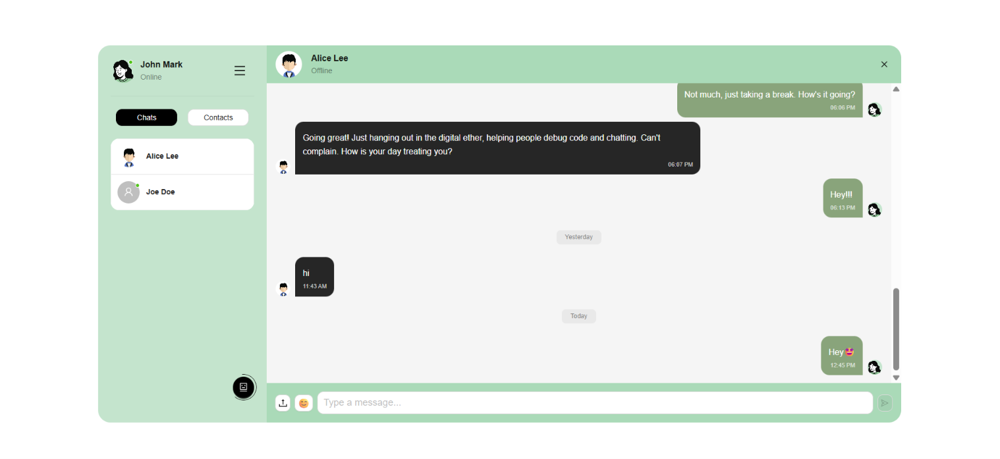
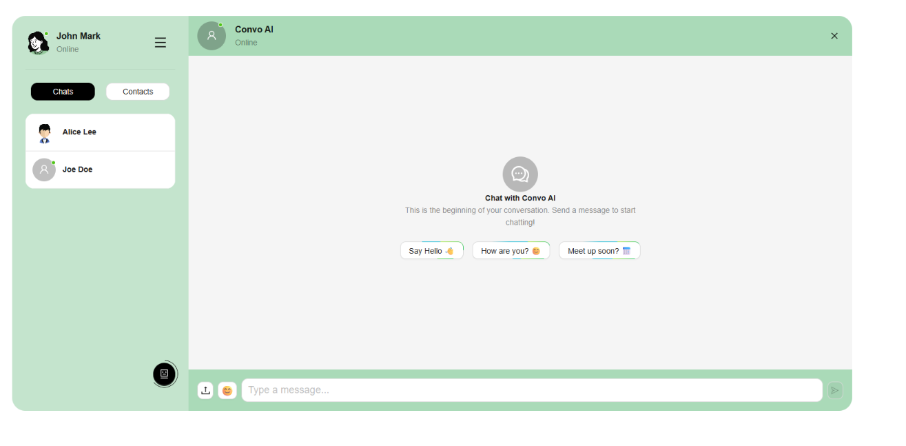

# Convo

Convo is a high-performance, real-time chat application featuring a seamless user interface and an integrated AI assistant. Built with React and TypeScript, it focuses on providing a rich user experience through interactive elements, audio feedback, and efficient state management.

## ✨ Key Features

- **Real-time Messaging:** Instant communication between users with message history and date-based organization.
- **Convo AI Integration:** A dedicated AI chat partner for automated assistance and conversation.
- **Rich Media Support:** Ability to send and preview images (Base64) and express yourself with a built-in emoji picker.
- **Interactive UX:**
  - **Audio Feedback:** Optional mechanical keyboard sound effects for typing and message events.
  - **Visual Polishing:** Smooth transitions, loading skeletons, and "thinking" indicators for AI responses.
  - **Responsive Layouts:** Sidebar-based navigation with tabbed views for "Chats" and "Contacts."
- **Profile Customization:** Real-time profile picture updates and online/offline status tracking.
- **Robust State Management:** Powered by Zustand for global state and TanStack Query for resilient data fetching and caching.

## 🛠️ Tech Stack

- **Frontend Framework:** [React](https://react.dev/) (Vite-powered)
- **Language:** [TypeScript](https://www.typescriptlang.org/)
- **UI Components:** [Ant Design (antd)](https://ant.design/)
- **State Management:**
  - [Zustand](https://zustand-demo.pmnd.rs/) (Auth & Chat Stores)
  - [TanStack Query v5](https://tanstack.com/query/latest) (Server state & Mutations)
- **Routing:** [React Router v7](https://reactrouter.com/)
- **Icons:** Ant Design Icons
- **Styling:** CSS Modules with SCSS

## 📁 Project Structure Highlights

- **`src/pages/chatPage`**: The core application logic, including the chat container, input systems, and user list.
- **`src/store`**: Centralized state management for authentication and chat sessions.
- **`src/hooks`**: Custom hooks for business logic like `useKeyboardSound` and API interactions.
- **`src/components`**: Reusable UI atoms like `ProfilePicture`, `ChatCard`, and `NoChatsFound`.

## 🚀 Getting Started

1. **Clone & Install:**

   ```bash
   git clone [your-repo-url]
   npm install
   ```

2. **Configuration:**
   Set up your environment variables for the backend API.

3. **Development:**
   ```bash
   npm run dev
   ```

## 💡 Technical Highlights

- **Performance:** Uses TanStack Query for efficient data caching and `useIsMutating` to track background AI processing states.
- **Clean Code:** Implements a modular component architecture with strict TypeScript typing for all chat entities.
- **Theming:** Customized Ant Design theme via `ConfigProvider` to match the "Convo" brand aesthetic.

## 📸 Look & Feel

To give you a quick visual overview of Convo, here are some screenshots of the application in action:






---
