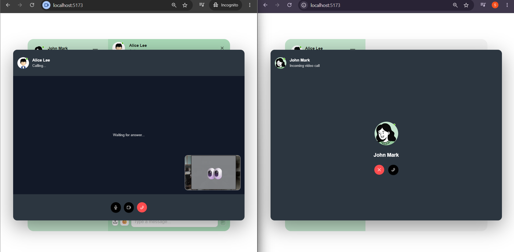
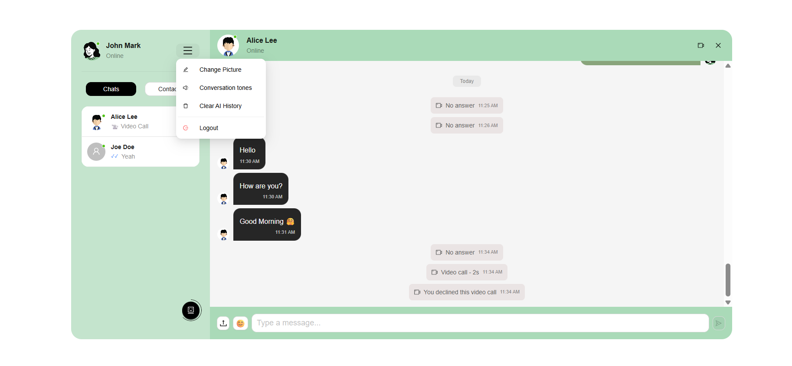
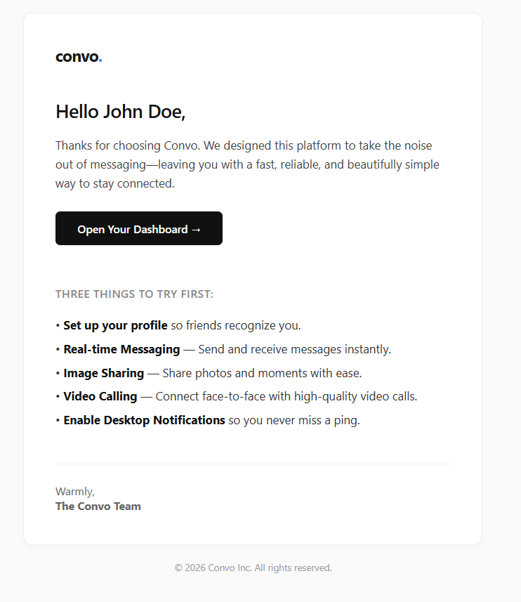
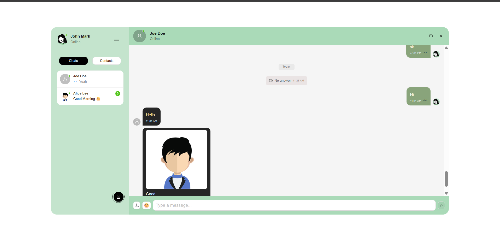
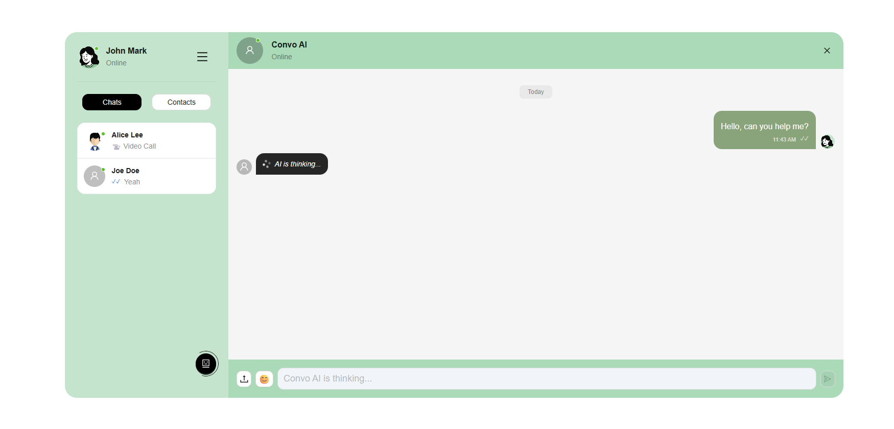

# Convo

Convo is a **real-time 1:1 chat application** with:

- **Messaging + media (image upload)**
- **Read receipts** (read/unread tracking)
- **AI chat mode** (Gemini-powered assistant)
- **Video calling** (WebRTC + Socket.IO signaling)

Built with **React + TypeScript** on the frontend and **Express + Socket.IO + MongoDB** on the backend.

---

## App screenshots




---

## Key features (what recruiters should understand quickly)

### 1) Authentication + profile

- Users can **sign up** and **log in**.
- Authentication is stored in **cookies** and used for subsequent API calls and Socket.IO connections.
- Users can update their **profile picture** from the chat sidebar header.
- On signup, the backend sends a **welcome email**.





### 2) Real-time messaging (1:1)

- A user selects a conversation from the sidebar.
- Messages are persisted in MongoDB.
- New messages are delivered instantly using **Socket.IO**.
- The chat UI groups messages and shows message timestamps.

### 3) Read receipts (read/unread)

- When a user opens a conversation, messages are marked as **read**.
- The system maintains a **read flag** and updates:
  - the message bubble read indicator for the sender
  - the unread counter in the chat list

### 4) Media messaging (image support)

- Users can attach an image from the chat input.
- The client converts the file to **Base64** for preview.
- The backend uploads the image to **Cloudinary** and stores the resulting URL.
- The chat stream renders the image inside the message bubble.



### 5) AI chat mode (Convo AI)

- The sidebar includes a **“Convo AI”** shortcut.
- AI is treated as a dedicated conversation partner.
- When the user sends a message to the AI:
  - the backend stores the user message in an `AIMessage` collection
  - builds Gemini chat history from recent messages
  - generates an AI response via Gemini
  - returns **both** the user message and the AI response
- The UI shows an **“AI is thinking…”** state while the AI response is being generated.




### 6) Video calling (WebRTC)

- From the chat header, users can start a **video call** with another user.
- Socket.IO handles the call lifecycle events:
  - **incoming call** prompt
  - **accept/reject**
  - **end/cancel/timeout**
- WebRTC handles media streaming:
  - peers exchange **offer/answer** and **ICE candidates**
  - local + remote video streams are displayed in a call overlay


---

## How the app works (end-to-end flow)

### Frontend (React)

- Navigation is driven by **React Router**.
- Authenticated users reach the chat UI via protected routes.
- The layout:
  - **Sidebar (Sider)**: profile header + chat list (Chats/Contacts) + AI shortcut
  - **Main panel**: messages for selected conversation + message input
  - **VideoCallOverlay**: shown when the call state is active

State & data:

- **Zustand** stores:
  - socket connection + online users (`useAuthStore`)
  - selected conversation + socket subscription + read/sound behaviors (`useChatStore`)
  - WebRTC call state (`useCallStore`)
- **TanStack Query** handles server-state caching:
  - contacts
  - chat partners
  - message history

### Socket.IO event flow (real-time updates)

- **NEW_MESSAGE**
  - emitted when a message is created
  - updates both the chat list and the open conversation stream
- **MESSAGE_READ** + `MARK_MESSAGES_READ`
  - emitted after a client marks messages as read
  - updates sender-side unread counters and read indicators
- **Call events**
  - incoming/accepted/rejected/cancelled/ended/timeout
- **WEBRTC_SIGNAL**
  - relays WebRTC signaling payloads (offer/answer/ICE candidates)

### Backend (Express + Socket.IO + MongoDB)

REST APIs:

- `POST /api/auth/*` for login/signup/logout/profile update
- `GET /api/messages/*` for message history and contacts/chat partners
- `POST /api/messages/:id` for sending messages (text + optional image)
- `POST /api/ai/*` for AI message history + AI reply generation

Message sending:

- If an image is included:
  - backend uploads to **Cloudinary**
  - stores the final image URL with the message
- Backend emits the new message via Socket.IO to online peers.

AI chat:

- Maintains AI chat history in `AIMessage`.
- Uses Gemini to generate responses based on recent history.

Video call persistence:

- When calls finish, the backend records call events as messages (message type = call) so calls appear in the conversation timeline.

---

## Tech stack

- **Frontend**: React, TypeScript, Vite, Ant Design, CSS Modules/SCSS
- **Data**: TanStack Query
- **State**: Zustand
- **Realtime**: Socket.IO
- **Backend**: Express, MongoDB (Mongoose), Cloudinary (images), Gemini (AI)
- **Video**: WebRTC + Socket.IO signaling

---

## Getting started

1. Clone and install

```bash
git clone [your-repo-url]
npm install
```

2. Configure environment variables

- Backend requires keys for:
  - MongoDB
  - Gemini
  - Cloudinary
  - Email provider (for welcome email)
  - JWT/cookie secret

3. Run

```bash
npm run dev
```

---

## Notes for demo day

- Start with **2 users** to demonstrate:
  - real-time messages
  - read receipts / unread counter
- Send an **image** to show media support.
- Open **Convo AI** and send a question to show AI thinking + AI response.
- Start a **video call** from the header to show WebRTC call overlay.
